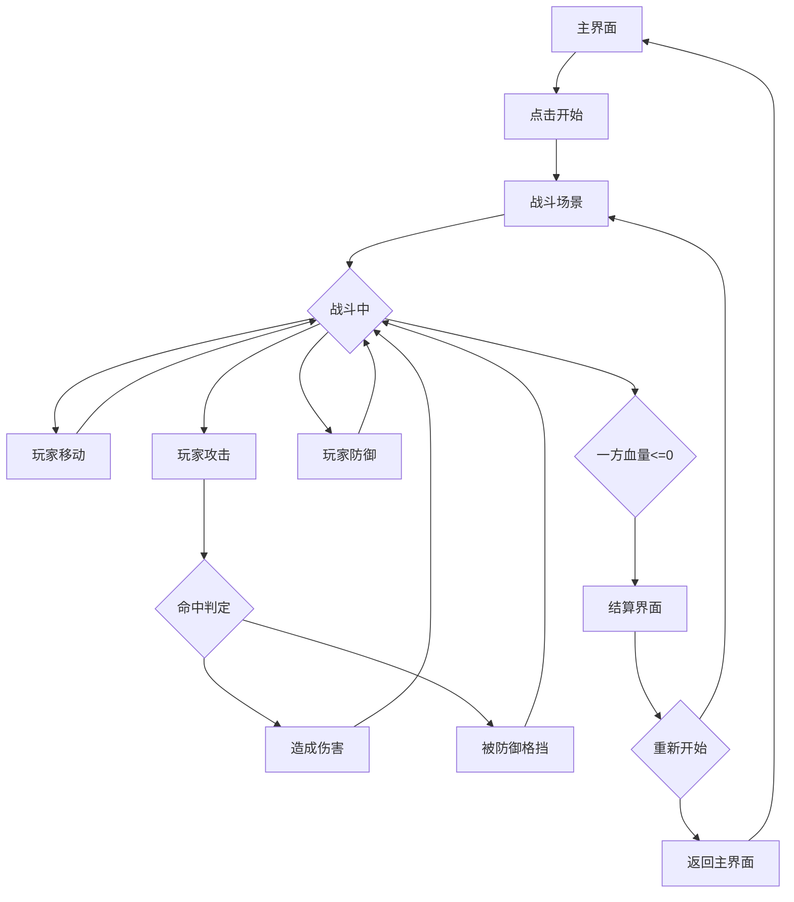

# 像素风机甲对战游戏 - 产品需求文档 (PRD)

## 1. 产品概述
一款复古像素风格的机甲对战小游戏，两名玩家各操控一台机甲进行实时对战。
- 目标用户：喜欢复古游戏、像素艺术和快节奏对战的玩家
- 核心价值：提供简单易上手但富有策略性的对战体验，唤起经典街机游戏的怀旧感

## 2. 核心功能

### 2.1 用户角色
| 角色 | 控制方式 | 核心操作 |
|------|----------|----------|
| 玩家1 (P1) | WASD + Q/E | 移动、攻击、防御 |
| 玩家2 (P2) | 方向键 + J/K | 移动、攻击、防御 |

### 2.2 功能模块
1. **战斗场景**：像素风格竞技场、边界检测、障碍物
2. **机甲系统**：两个独特机甲角色、血量显示、状态动画
3. **对战系统**：攻击判定、防御机制、伤害计算、胜负判定
4. **UI系统**：血量条、能量条、操作提示、胜负结算画面

### 2.3 页面详情
| 页面名称 | 模块名称 | 功能描述 |
|----------|----------|----------|
| 主界面 | 游戏标题 | 显示游戏名称、开始按钮、操作说明 |
| 战斗场景 | 竞技场 | 像素风格场景、边界碰撞、地面纹理 |
| 战斗场景 | 机甲角色 | 两台机甲、移动动画、攻击动画、防御姿态、受伤反馈 |
| 战斗场景 | HUD | 双方血量条、能量条、时间显示 |
| 结算界面 | 胜负结果 | 显示胜者、战斗统计、重新开始按钮 |

## 3. 核心流程

游戏主流程：
1. 玩家进入主界面，查看操作说明
2. 点击开始游戏，进入战斗场景
3. 双方玩家操控机甲进行移动、攻击、防御
4. 当一方血量归零时，判定胜负
5. 显示结算界面，可选择重新开始或返回主界面

## 4. 用户界面设计

### 4.1 设计风格
- **主色调**：深蓝/黑色背景 + 霓虹青色/橙色强调色（赛博朋克风格）
- **像素风格**：8-bit 复古像素艺术，低分辨率大像素块
- **字体**：像素字体 (Press Start 2P)
- **按钮**：像素边框按钮，带按压效果
- **动画**：帧动画、屏幕震动、闪烁效果
- **音效提示**：视觉反馈代替（闪光、震动）

### 4.2 页面设计概览
| 页面名称 | 模块名称 | UI 元素 |
|----------|----------|---------|
| 主界面 | 标题区 | 大像素字体标题、闪烁效果、机甲剪影装饰 |
| 主界面 | 操作说明 | 控制键位图示、像素风格图标 |
| 主界面 | 开始按钮 | 大像素按钮、悬停发光效果 |
| 战斗场景 | 竞技场 | 像素地面纹理、边界墙、背景星空/城市剪影 |
| 战斗场景 | 机甲P1 | 蓝色系机甲、行走/攻击/防御帧动画、血量条 |
| 战斗场景 | 机甲P2 | 红色系机甲、行走/攻击/防御帧动画、血量条 |
| 战斗场景 | HUD | 顶部血量条、能量条、VS标志 |
| 结算界面 | 胜利画面 | 胜者机甲展示、胜利字样、统计面板 |
| 结算界面 | 按钮区 | 重新开始、返回主菜单按钮 |

### 4.3 响应式设计
- 桌面优先：最佳体验为 1280x720 分辨率
- 移动适配：虚拟按键覆盖层
- 触摸优化：大尺寸虚拟按钮、触摸反馈

### 4.4 游戏机制设计

#### 机甲属性
| 属性 | 机甲A (突击型) | 机甲B (重装型) |
|------|----------------|----------------|
| 血量 | 100 HP | 150 HP |
| 移动速度 | 快 (5px/帧) | 慢 (3px/帧) |
| 攻击力 | 15 HP | 25 HP |
| 攻击范围 | 近距离 | 中距离 |
| 特殊技能 | 冲刺攻击 | 护盾防御 |

#### 操作映射
| 操作 | 玩家1 | 玩家2 | 效果 |
|------|-------|-------|------|
| 向左 | A | ← | 机甲向左移动 |
| 向右 | D | → | 机甲向右移动 |
| 跳跃 | W | ↑ | 机甲跳跃 |
| 下蹲 | S | ↓ | 机甲下蹲/防御 |
| 攻击 | Q | J | 发动攻击 |
| 特殊技能 | E | K | 发动特殊技能 |

#### 战斗机制
- **普通攻击**：近战范围判定，命中造成基础伤害
- **防御**：按住下蹲键进入防御姿态，减少50%伤害
- **特殊技能**：消耗能量条，发动强力技能
- **能量恢复**：随时间缓慢恢复，成功防御额外恢复
- **硬直时间**：攻击后短暂硬直，被击中也有硬直

## 5. 素材方案

### 5.1 像素素材清单
| 素材类型 | 描述 | 尺寸 |
|----------|------|------|
| 机甲A站立 | 4帧动画 | 32x48 px |
| 机甲A行走 | 4帧动画 | 32x48 px |
| 机甲A攻击 | 3帧动画 | 48x48 px |
| 机甲A防御 | 1帧静态 | 32x40 px |
| 机甲A受伤 | 2帧动画 | 32x48 px |
| 机甲B站立 | 4帧动画 | 40x56 px |
| 机甲B行走 | 4帧动画 | 40x56 px |
| 机甲B攻击 | 3帧动画 | 56x56 px |
| 机甲B防御 | 1帧静态 | 40x48 px |
| 机甲B受伤 | 2帧动画 | 40x56 px |
| 地面纹理 | 可平铺 | 16x16 px |
| 背景层 | 远景城市 | 256x128 px |
| 特效-打击 | 3帧动画 | 32x32 px |
| 特效-火花 | 4帧动画 | 16x16 px |

### 5.2 素材实现方式
- 使用 Canvas 绘制程序化像素图形
- 帧动画通过精灵图或代码绘制实现
- 特效使用粒子系统模拟
