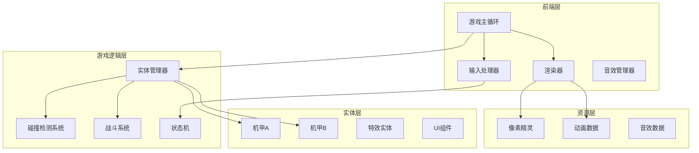

# 像素风机甲对战游戏 - 技术架构文档

## 1. 架构设计



## 2. 技术说明

- **前端框架**: React 18 + TypeScript + Vite
- **样式方案**: Tailwind CSS 3 + CSS Modules (像素风格定制)
- **游戏渲染**: HTML5 Canvas 2D
- **状态管理**: Zustand (轻量级状态管理)
- **动画方案**: requestAnimationFrame + 帧动画系统
- **构建工具**: Vite
- **后端服务**: 无 (纯前端游戏)

## 3. 路由定义

| 路由 | 用途 |
|------|------|
| / | 主界面 (标题画面) |
| /battle | 战斗场景 |
| /result | 结算界面 |

## 4. 核心模块设计

### 4.1 游戏引擎模块

```typescript
interface GameEngine {
  canvas: HTMLCanvasElement;
  ctx: CanvasRenderingContext2D;
  entities: Entity[];
  inputManager: InputManager;
  collisionSystem: CollisionSystem;
  isRunning: boolean;
  
  start(): void;
  stop(): void;
  update(deltaTime: number): void;
  render(): void;
}
```

### 4.2 实体系统

```typescript
interface Entity {
  id: string;
  type: 'mecha' | 'effect' | 'projectile';
  position: Vector2D;
  velocity: Vector2D;
  width: number;
  height: number;
  active: boolean;
  
  update(deltaTime: number): void;
  render(ctx: CanvasRenderingContext2D): void;
}

interface Mecha extends Entity {
  playerId: 1 | 2;
  hp: number;
  maxHp: number;
  energy: number;
  maxEnergy: number;
  state: MechaState;
  facing: 'left' | 'right';
  stats: MechaStats;
  animation: AnimationController;
}

type MechaState = 
  | 'idle' 
  | 'walking' 
  | 'jumping' 
  | 'attacking' 
  | 'defending' 
  | 'hurt' 
  | 'dead';

interface MechaStats {
  speed: number;
  jumpForce: number;
  attackDamage: number;
  attackRange: number;
  specialDamage: number;
}
```

### 4.3 输入处理

```typescript
interface InputManager {
  keys: Set<string>;
  bindings: Map<string, Action[]>;
  
  onKeyDown(key: string): void;
  onKeyUp(key: string): void;
  isPressed(action: Action, playerId: number): boolean;
}

type Action = 
  | 'moveLeft' 
  | 'moveRight' 
  | 'jump' 
  | 'crouch' 
  | 'attack' 
  | 'special';
```

### 4.4 碰撞检测

```typescript
interface CollisionSystem {
  checkAABB(a: Entity, b: Entity): boolean;
  checkAttack(attacker: Mecha, target: Mecha): boolean;
  resolveCollision(entity: Entity, boundary: Rect): void;
}
```

### 4.5 战斗系统

```typescript
interface CombatSystem {
  executeAttack(attacker: Mecha, target: Mecha): AttackResult;
  applyDamage(target: Mecha, damage: number, isBlocked: boolean): void;
  checkVictory(mechaA: Mecha, mechaB: Mecha): VictoryState | null;
}

interface AttackResult {
  hit: boolean;
  damage: number;
  blocked: boolean;
  knockback: Vector2D;
}
```

### 4.6 动画系统

```typescript
interface AnimationController {
  currentAnimation: string;
  currentFrame: number;
  frameTimer: number;
  frameDuration: number;
  
  play(name: string): void;
  update(deltaTime: number): void;
  getCurrentSprite(): SpriteData;
}

interface SpriteData {
  pixels: number[][];
  offsetX: number;
  offsetY: number;
}
```

## 5. 文件结构

```
src/
├── components/
│   ├── GameCanvas.tsx       # 游戏画布组件
│   ├── HUD.tsx              # 血量条、能量条UI
│   ├── TitleScreen.tsx      # 主界面
│   ├── BattleScreen.tsx     # 战斗场景
│   └── ResultScreen.tsx     # 结算界面
├── game/
│   ├── engine/
│   │   ├── GameLoop.ts      # 游戏主循环
│   │   ├── InputManager.ts  # 输入处理
│   │   └── Renderer.ts      # 渲染器
│   ├── entities/
│   │   ├── Entity.ts        # 实体基类
│   │   ├── Mecha.ts         # 机甲类
│   │   └── Effect.ts        # 特效类
│   ├── systems/
│   │   ├── CollisionSystem.ts   # 碰撞检测
│   │   └── CombatSystem.ts      # 战斗系统
│   └── animation/
│       ├── AnimationController.ts
│       └── SpriteData.ts
├── data/
│   ├── mechaSprites.ts      # 机甲像素数据
│   └── animations.ts        # 动画配置
├── hooks/
│   └── useGame.ts           # 游戏状态Hook
├── store/
│   └── gameStore.ts         # Zustand状态存储
├── utils/
│   └── pixelArt.ts          # 像素绘制工具
└── App.tsx
```

## 6. 性能优化策略

1. **渲染优化**
   - 使用离屏 Canvas 缓存静态背景
   - 仅重绘发生变化的区域
   - 使用 `will-change: transform` 优化 CSS 动画

2. **碰撞检测优化**
   - 使用空间分区减少检测次数
   - AABB 快速检测 + 精确检测两阶段

3. **动画优化**
   - 预计算所有帧的像素数据
   - 使用精灵图集减少绘制调用

## 7. 数据模型

### 7.1 游戏状态模型

```typescript
interface GameState {
  phase: 'title' | 'battle' | 'result';
  mechaA: MechaState;
  mechaB: MechaState;
  winner: 1 | 2 | null;
  battleTime: number;
}

interface MechaState {
  hp: number;
  energy: number;
  position: { x: number; y: number };
  velocity: { x: number; y: number };
  state: MechaStateType;
  facing: 'left' | 'right';
}
```

### 7.2 配置数据

```typescript
const GAME_CONFIG = {
  CANVAS_WIDTH: 800,
  CANVAS_HEIGHT: 450,
  GROUND_Y: 380,
  GRAVITY: 0.8,
  MAX_HP_A: 100,
  MAX_HP_B: 150,
  MAX_ENERGY: 100,
  ENERGY_REGEN: 0.5,
  BLOCK_DAMAGE_REDUCTION: 0.5,
};

const MECHA_CONFIG = {
  A: {
    speed: 5,
    jumpForce: 15,
    attackDamage: 15,
    attackRange: 60,
    specialDamage: 30,
    specialEnergyCost: 50,
  },
  B: {
    speed: 3,
    jumpForce: 12,
    attackDamage: 25,
    attackRange: 80,
    specialDamage: 40,
    specialEnergyCost: 60,
  },
};

const INPUT_BINDINGS = {
  player1: {
    moveLeft: 'KeyA',
    moveRight: 'KeyD',
    jump: 'KeyW',
    crouch: 'KeyS',
    attack: 'KeyQ',
    special: 'KeyE',
  },
  player2: {
    moveLeft: 'ArrowLeft',
    moveRight: 'ArrowRight',
    jump: 'ArrowUp',
    crouch: 'ArrowDown',
    attack: 'KeyJ',
    special: 'KeyK',
  },
};
```
